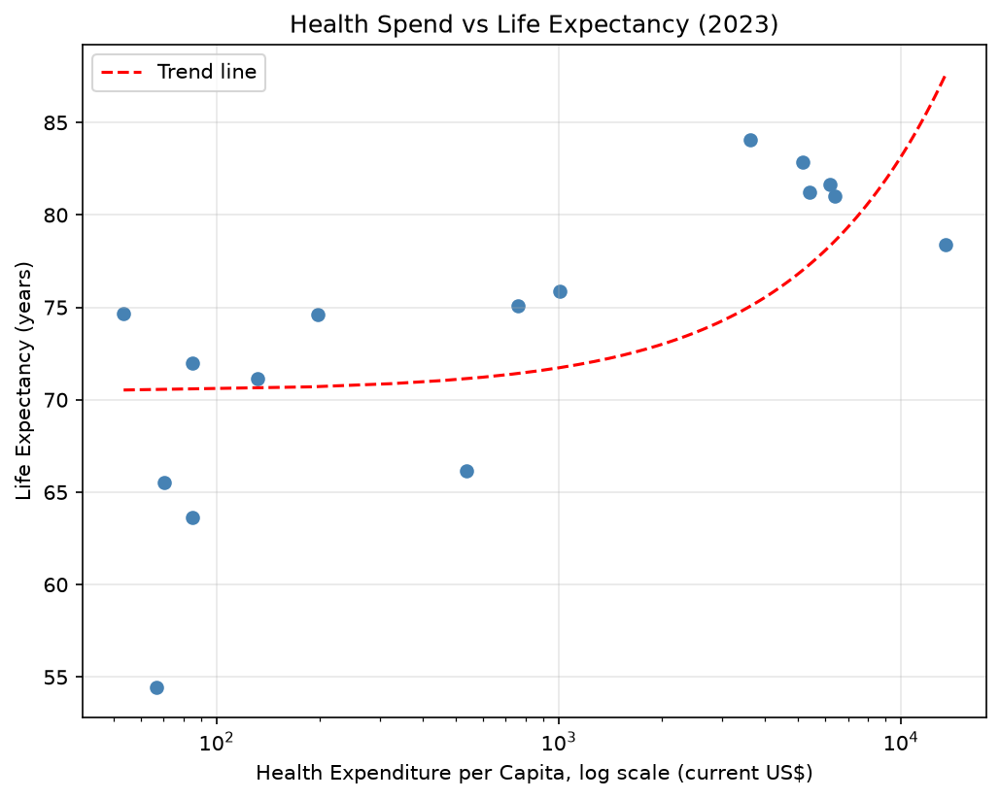

# Global Health System Performance Diagnostic

A data-driven diagnostic of health system performance across countries, built the way a consultancy engagement is structured: situation - data-driven diagnosis - prioritised recommendations.

## Project Objective

Using public global health datasets (WHO Global Health Observatory, World Bank), this project identifies which countries and health system indicators show the greatest inefficiency or inequality, quantifies the gap, and translates the findings into prioritised, actionable recommendations - mirroring a real health systems consultancy deliverable.
Currently applying these skills in live job applications for data & strategy consulting roles.

## Structure

```
global-health-diagnostic/
├── data/
│   ├── raw/            # Original, unmodified source data
│   └── processed/      # Cleaned data ready for analysis
├── sql/                # SQL scripts: schema, KPI queries
├── notebooks/          # Python analysis (exploration, stats, visuals)
├── dashboard/          # Dashboard files (Power BI / Tableau / web)
└── docs/               # Findings briefing, methodology notes
```

## Tools

SQL, Python (pandas, matplotlib), Power BI / Tableau

## Status

In progress - built iteratively, day by day. Days 1-2: repo and profile setup. Days 3-4: first real data pulled via the World Bank API, local Git connected, first bug fixed. See [progress log](docs/progress-log.md) and [dev diary](docs/DEVLOG.md) for daily updates.
## Skills in Practice

Beyond the tools listed above, this project has been a hands-on way to build real fluency in Python fundamentals (loops, dictionaries, f-strings), Git version control, and debugging - not just running pre-written code, but understanding and fixing it.

## Roadmap

See [docs/ROADMAP.md](docs/ROADMAP.md) for the full plan: objective, rationale, methodology, real-world applicability, and anticipated challenges.

## Findings & Recommendations

To be added once SQL and Python analysis are complete - a one-page consultancy-style briefing.

## Sample Finding



Health expenditure per capita and life expectancy show a moderate positive correlation (0.59) across the 16 countries in this dataset — but with significant variation, suggesting spend alone doesn't determine outcomes.

## Author

Ilias Kubica - [LinkedIn](https://linkedin.com/in/iliaskubica)
